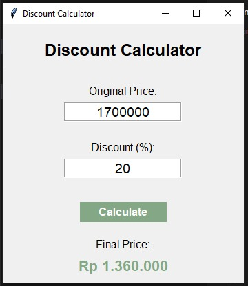

# Discount Calculator

A program discount calculator developed using Python and Tkinter.  
This application helps users calculate the final price after applying a discount, with the output formatted in Indonesian Rupiah (Rp).

## Application Preview

## Key Features
- Simple and intuitive graphical interface
- Discount calculation based on percentage input
- Automatic currency formatting in Rupiah (Rp)
- Input checking to prevent invalid values
- Lightweight and easy-to-use application

## System Requirements
- Python 3.12 or newer
- Tkinter (bundled with Python)

## How to Use
1. Enter the original price in the Original Price
2. Enter the discount percentage in the Discount (%)
3. Click the Calculate button
4. The final price will be displayed in Rupiah format

## Example
Original Price: 1700000
Discount (%): 20
Final Price: Rp 1.360.000